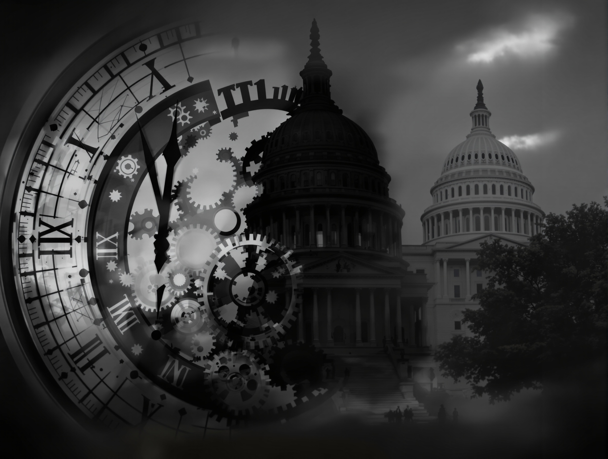

# The 2025 Shutdown: A Constitutional Crisis Brewing in Plain Sight

*By Stiles Seymens*

At 12:01 a.m. on October 1, 2025, the United States government faced a familiar crisis: a partial shutdown. The fiscal year had ended, and Congress hadn't passed new funding. But this wasn't just another budget squabble; it felt like something more fundamental was at stake.

This isn't just a fiscal blip or partisan standoff. It's rapidly becoming a constitutional crisis – one that tests the very foundations of American governance: the power of the purse, separation of powers, and the duty of lawmakers and the executive to govern.

## How We Got Here: Political Strategy Meets Fiscal Weaponization

The road to this shutdown was paved with predictable political maneuvers. Congress typically passes funding bills by September 30th, but in 2025, a Republican-controlled Congress and Democratic opposition in the Senate created a perfect storm. Aggressive budget rescissions, partisan messaging treating the lapse as a strategic battleground – all pointed to an impending showdown.

The breakdown stemmed from three overlapping disputes:

**Funding Levels & Duration:** Republicans sought a continuing resolution (CR) extending funding into January 2026, maximizing their leverage. Democrats pushed for a shorter term (ending November) to force negotiations on key issues.

**Health-Care & Domestic Program Funding:** Democrats insisted on extending tax credits under the Affordable Care Act (ACA) and preventing programmatic cuts. Republicans excluded those demands, aiming to force Democratic capitulation.

**Rescissions & Executive Leverage:** The Rescissions Act of 2025, rescinding billions in foreign aid and public broadcasting funds, signaled a new era of funding control – one where cuts could be directed after the annual appropriations process.

The House passed a CR excluding ACA subsidies, but the Senate repeatedly failed to pass it. Meanwhile, internal memos revealed the White House viewed the lapse as an opportunity: "use the shutdown to implement permanent cuts, restructure government." The stage was set. When midnight passed without an agreement, the government shut down.

> *"This isn't just about money; it's a test of whether we can govern."*

## The Legal Architecture Under Pressure: Power, Separation, and Impoundment

At the heart of this crisis lies a fundamental question: who controls the purse? The Constitution's Appropriations Clause (Article I, Section 9) states: "No Money shall be drawn from the Treasury, but in Consequence of Appropriations made by Law." Federal statute – the Antideficiency Act (ADA) – implements this, requiring agencies to suspend operations when funding lapses.

During a shutdown, agencies must cut back, furlough workers, and refrain from entering commitments. But the story doesn't end there.

The 1974 Congressional Budget and Impoundment Control Act (IBCA) aimed to curb executive impoundments. Yet, the aggressive use of rescissions – and the freezing of funds to certain states during the shutdown – blurs the line between impoundment and shutdown tactics.

The separation of powers is under immense pressure:

- If agencies use the shutdown to carry out permanent reorganizations or layoffs without Congress, that may violate Congress's appropriations power.
- If the President selectively funds (or defunds) programs based on political outcomes, that undermines legislative intent.

> *"The Constitution isn't just a document; it's a framework for resolving disputes, and right now, that framework is being tested."*

## The Human Cost: Furloughs, Program Disruptions, and Politicized Appropriations

The shutdown's impact is far-reaching:

- Roughly 750,000 federal civilian employees have been furloughed.
- Essential workers continue to work without pay, raising legal questions under the Fair Labor Standards Act (FLSA).
- Programs like WIC face funding shortages.
- TSA staff and air traffic controllers are experiencing increased absenteeism, raising safety concerns.
- SNAP benefits for millions are at risk.

One of the most alarming developments: the Trump administration froze ~$26 billion in federal funding earmarked for transit, green-energy, and other programs in predominantly Democratic states. Critics argue this is political retribution – a violation of Congress's budgeting purpose.

> *"This isn't just about numbers; it's about the lives of real people, and their access to essential services."*

## Leadership Under Fire: Where Did It Go Wrong?

The blame game is inevitable, but it obscures deeper systemic issues:

**President Trump:** Viewed the shutdown as a strategic advantage, with internal memos revealing plans for permanent changes.

**Speaker Mike Johnson:** Chose a strategy of delay and partisanship, refusing to reconvene the House for votes or negotiations.

**Senate Leaders:** Both sides used constitutional tools, but a collective unwillingness to compromise has invited criticism.

## The Legal Battles Brewing: AFGE v. OMB & Beyond

Several legal challenges are underway, with potentially far-reaching consequences:

**AFGE v. OMB:** The American Federation of Government Employees sued, alleging agencies' RIF plans violated statute and the APA.

**Hatch Act Concerns:** Agency messaging blaming Democrats triggered Hatch Act complaints, raising concerns about government resources being used for partisan ends.

**State Litigation:** Lawsuits from states like New York or California may challenge the freezing of funds.

**Labor & Contractor Claims:** Federal employees and contractors are likely to file suits for delayed wages.

> *"The courts will play a crucial role in determining the boundaries of executive power during this crisis."*

## What Happens Next? Scenarios & Reform Imperatives

Several scenarios are possible:

- **Short-term CR:** The most likely outcome.
- **Bipartisan Override/Internal Fracture:** A coalition could pass a clean funding bill.
- **Prolonged Shutdown:** The most damaging outcome.

### Reform Imperatives:

- **Automatic Continuing Appropriations:** Legislation would automatically fund the government at current levels.
- **Constraints on Executive Restructuring:** New laws would limit a President's ability to reorganize during funding lapses.
- **Reduce Use of Shutdowns:** Address the underlying causes that lead to these recurring crises.

> *"The 2025 shutdown isn't just a moment in time; it's an opportunity to strengthen our constitutional framework."*

## Final Thoughts: A Crisis of Governance, Not Just Budget

The 2025 federal government shutdown is a test of America's constitutional order. It's about more than just money; it's about the principles that underpin our system of government.

If the constitution is to remain more than a relic, these rules must be defended. And when they are not, the clock on institutional legitimacy ticks faster than any congressional deadline.
